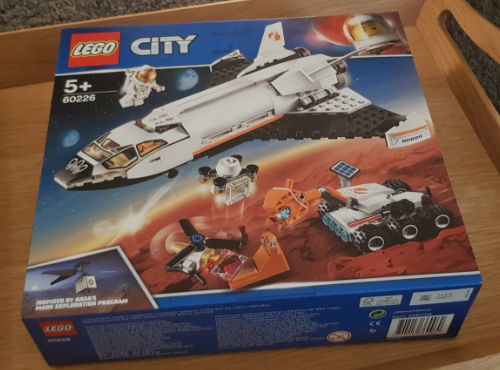
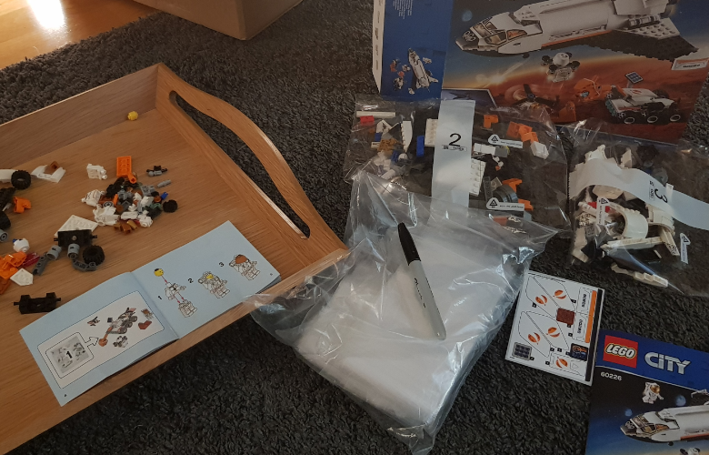
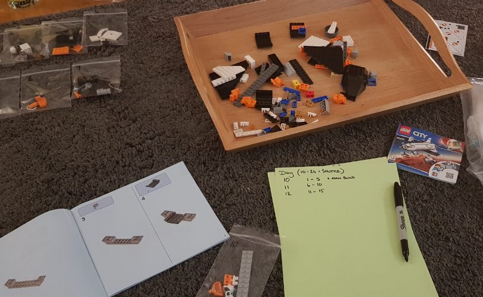
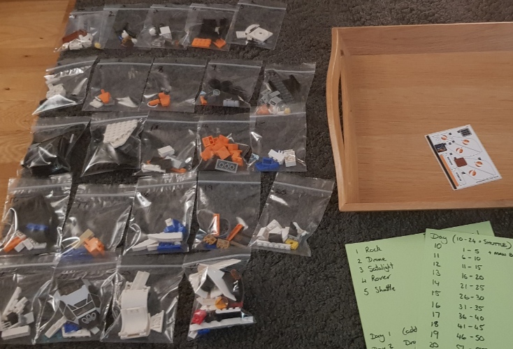
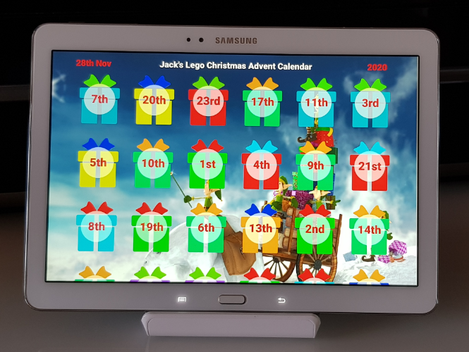
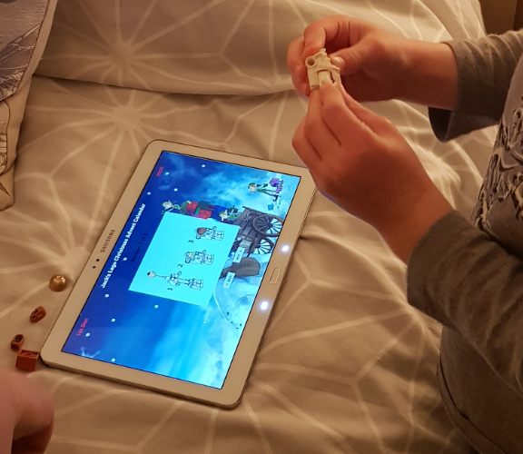
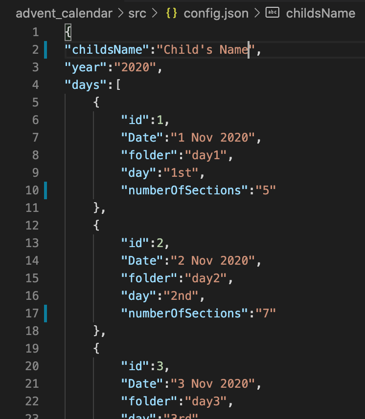
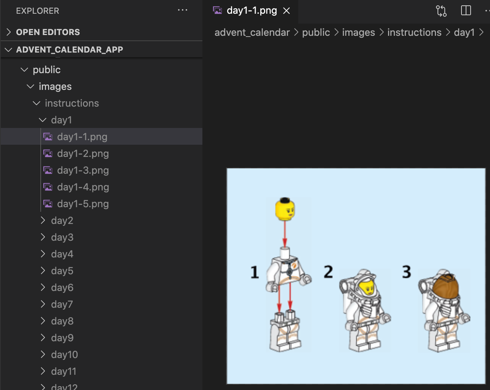

# Alternitive Lego Advent Calendar

This is a project that was inspired for a Lego advent calendar I created for my son a couple of years ago. At that point I split a Lego set down into a few section per day and printed of the relevent instruction sections for my son to build each day.

This year I desided to do the samething again, but this time using my new skills to create a simple app that will show him the sections to build for that day. It will also not let him view any days untill it is that day or has passed.

Built with ReactJS and hosted on IONOS webhosting. The app will be available for him to use on a tablet.

This project sparked a further digital advent calendar for the Scottish Tech Army, which I was asked to create and deploy within a week.

<a href="https://github.com/aramsay03/STA-Advent-Calendar_2020">Scottish Tech Army Advent Calendar Repo</a>
***
## Preview of the working app
<a href="http://advent.aramsay.co.uk" target="_blank">Demo of the Calendar working</a>  
***
## Some pictures of the non digital elements of the project.
 

 

## The code requires a config.json file that looks like this:

## The instruction image file structure looks like this:

***

<!-- <video width="320" height="240" controls>
  <source src="./readme_files/appdemo.mov" type="video/mp4">
</video> -->

<!--  -->

# Getting Started with Create React App

This project was bootstrapped with [Create React App](https://github.com/facebook/create-react-app).

## Available Scripts

In the project directory, you can run:

### `npm start`

Runs the app in the development mode.\
Open [http://localhost:3000](http://localhost:3000) to view it in the browser.

The page will reload if you make edits.\
You will also see any lint errors in the console.

### `npm test`

Launches the test runner in the interactive watch mode.\
See the section about [running tests](https://facebook.github.io/create-react-app/docs/running-tests) for more information.

### `npm run build`

Builds the app for production to the `build` folder.\
It correctly bundles React in production mode and optimizes the build for the best performance.

The build is minified and the filenames include the hashes.\
Your app is ready to be deployed!

See the section about [deployment](https://facebook.github.io/create-react-app/docs/deployment) for more information.

## Learn More

You can learn more in the [Create React App documentation](https://facebook.github.io/create-react-app/docs/getting-started).

To learn React, check out the [React documentation](https://reactjs.org/).